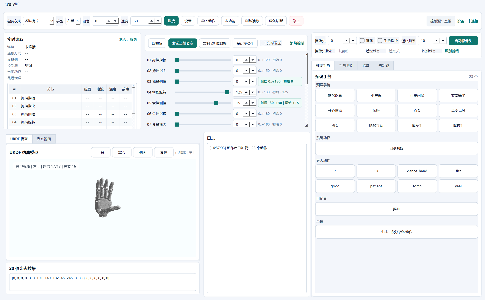

# Xbotics O20 控制台

面向 O20 灵巧手的跨平台桌面控制台，提供连接、读数、手动调姿、预设动作、手势遥控、宏执行和 URDF 可视化。Windows 与 Linux 均可运行；仓库内包含界面资源、动作库、手部识别模型和 URDF/STL 模型资源。



## 功能

- 连接控制：支持直连模式、ROS2节点模式和虚拟模式。
- 实时读数：显示 16 个关节的位置、电流、温度和故障状态。
- 手动调姿：16 路滑块控制，支持发送当前姿态、实时发送、保存动作。
- 同步反馈：URDF 模型、姿态视图、滑块和 20 位姿态数据保持同步。
- 视角控制：URDF 模型支持手背、掌心、侧面和复位视角。
- 手势遥控：摄像头识别手部姿态，并映射到 O20 关节空间。
- 遥控调参：可调整平滑、侧摆灵敏度、侧摆死区和发送阈值，并显示最近侧摆输出。
- 动作系统：预设手势、txt 动作导入、自定义动作和宏队列。
- 安全防护：步长限制、电流/温度保护、停止请求和控制源互斥。
- 诊断工具：检查运行环境、CANFD 运行文件、设备响应和动作库格式。

## 更新日志

### v0.2.0 (2026-07-20)

**界面优化**
- 全面重写 QSS 样式表：渐变按钮、圆角卡片、自定义滚动条、焦点高亮、工具提示深色主题
- 工具栏分组（连接参数 / 功能 / 诊断），添加分隔线
- 关节编辑器按手指分组（拇指 / 食指 / 中指 / 无名指 / 小指）
- 数字孪生姿态视图：渐变背景、高光指段、指尖高亮、渐变手掌
- 摄像头 / 猜拳面板暗色预览区渐变背景
- 日志面板等宽字体，底部状态栏实时显示最新日志
- 选项卡圆角、滑块渐变手柄、复选框主题色

**代码质量**
- 提取 `_MacroQueueMixin` 消除 MacroDialog / MacroPanel 重复逻辑 (DRY)
- `math_cos` / `math_sin` 改为模块级 `import math`，消除函数内重复导入
- 版本号同步至 `__init__.py` 和 `pyproject.toml`

### v0.1.4

- 优化手势遥控侧摆控制参数
- 界面细节打磨

### v0.1.3

- 对齐 O20 侧摆中立空间
- 安全审计路径加固

## 快速开始

Windows PowerShell：

```powershell
cd "xbotics_o20"
python -m venv ".venv"
.\.venv\Scripts\Activate.ps1
python -m pip install -r "requirements.txt"
python "run_console.py"
```

Linux：

```bash
cd "xbotics_o20"
python3 -m venv ".venv"
source ".venv/bin/activate"
python -m pip install -r "requirements.txt"
python "run_console.py"
```

首次只想查看界面和动作库，可选择“虚拟模式”。连接实物前建议先运行诊断：

```bash
PYTHONPATH=src python -m xbotics_o20 scan --canfd-library
PYTHONPATH=src python -m xbotics_o20 probe-direct --max-device 1
PYTHONPATH=src python -m xbotics_o20 canfd-diag --canfd-device 0
```

真机前自检：

| 步骤 | 要看什么 | 通过后再做 |
| --- | --- | --- |
| `scan --canfd-library` | 能加载运行文件，能扫描到适配器 | 继续只读探测 |
| `probe-direct --max-device 1` | 能读到左右手回包 | 连接控制台 |
| `canfd-diag --canfd-device 0` | 收发返回值正常 | 低速、小幅动作 |

## 控制逻辑

控制台把“显示同步”和“控制发送”分开处理：

- 未开启遥控或动作时，滑块是手动输入，拖动后会同步 URDF、姿态视图和 20 位姿态数据。
- 开启手势遥控、动作播放或宏执行时，滑块切换为“实时读数”，只跟随当前姿态显示，不再接受手动抢控制。
- 顶部和读数面板会显示当前控制源；控制源为空闲时滑块才负责控制发送。
- 侧摆关节滑块会标注运动范围和初始位置，便于确认负值、正值和回初始位置。
- 手势遥控参数默认保持原有控制手感；侧摆识别偏弱时先提高“侧摆灵敏”，抖动明显时再增加“侧摆死区”或降低“发送阈值”。
- 手动实时、手势遥控、动作播放、宏执行同一时间只能有一个发送源。
- 默认回初始采用中性侧摆姿态；避让姿态保护为显式开关，默认不压住食指/小指侧摆。
- 每次发送都会经过关节范围、最大步长、电流和温度保护；触发保护后会停止当前实时控制。
- 动作播放、宏执行和命令行单帧发送都会从当前读数开始拆步，停止/失败回初始也按最大步长执行。

## 资源

```text
xbotics_o20/
├── run_console.py
├── assets/hand_landmarker.task
├── docs/ui-preview.png
├── resources/
│   ├── canfd/win-x64/
│   └── urdf/
│       ├── urdf_viewer.js
│       └── model/
├── runtime/
│   ├── config.json
│   └── action_library/actions.json
├── src/xbotics_o20/
└── tests/
```

URDF 模型页优先读取 `resources/urdf/model`，因此克隆仓库后即可显示三维模型。若 Qt WebEngine 不可用，界面会保留二维姿态视图。

## 常用命令

```bash
PYTHONPATH=src python -m xbotics_o20 doctor
PYTHONPATH=src python -m xbotics_o20 validate-actions
PYTHONPATH=src python -m xbotics_o20 list-actions
PYTHONPATH=src python -m xbotics_o20 play wave_left --backend mock --progress
```

导入 txt 动作目录：

```bash
PYTHONPATH=src python -m xbotics_o20 import-demo "<动作目录>" --save
```

动作库位于 `runtime/action_library/actions.json`。每帧使用 16 个关节值：

```json
{
  "name": "wave_left",
  "title": "挥左手",
  "category": "preset",
  "loop": 1,
  "frames": [
    {
      "positions": [0, 0, 0, 0, 0, 0, 0, 0, 0, 0, 0, 0, 0, 0, 0, 0],
      "speed": 60,
      "hold_sec": 0.18
    }
  ]
}
```

## Linux 权限

如果诊断结果显示 USB 节点不可写，安装一次 udev 规则，拔插 CANFD 适配器后重新连接：

```bash
PYTHONPATH=src python -m xbotics_o20 udev-rule
sudo env PYTHONPATH=src python -m xbotics_o20 udev-rule --install
```

## 测试

```bash
PYTHONDONTWRITEBYTECODE=1 PYTHONPATH=src QT_QPA_PLATFORM=offscreen python -m pytest -q -p no:cacheprovider tests
```
